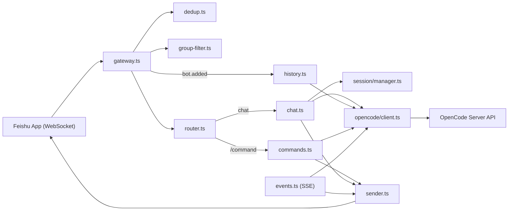

# OpenCode 飞书插件

独立运行的飞书机器人服务，通过飞书 WebSocket 长连接与本地 [OpenCode](https://github.com/anomalyco/opencode) Server 对接，在飞书内与 AI 对话、管理会话、切换模型与 Agent，并支持流式回复与实时占位更新。无需公网服务器即可完成从零到可用的对接。

**主要能力：**

- **飞书 WebSocket 长连接**：使用飞书「事件与回调」的「长连接」模式接收消息，无需配置 Webhook 地址。
- **OpenCode 对话**：将飞书消息转为 OpenCode 会话的 prompt，通过轮询 + SSE 事件流获取回复并回写到飞书。
- **命令**：`/help`、`/models`、`/model`、`/session`（list/new/switch/delete/info）、`/agents`、`/agent`、`/health`。
- **群聊静默监听**：始终将群消息转发给 OpenCode 积累上下文，仅在 bot 被直接 @提及时才回复，避免刷屏。
- **入群上下文摄入**：bot 被拉入群聊时，自动读取历史消息作为 OpenCode 对话上下文。
- **SSE 事件流**：实时更新「正在思考…」占位消息，断线自动重连（5 秒间隔）。

---

## 架构概览



- **命令路径**：用户发送 `/xxx` → 路由到 `commands.ts`，调用 OpenCode 客户端或会话管理器，结果经 `sender.ts` 发回飞书。
- **对话路径**：用户发送普通消息 → `chat.ts` 获取/创建 OpenCode 会话、发送 prompt，轮询消息列表并在稳定后回写；同时 `events.ts` 订阅 OpenCode SSE，实时更新飞书占位消息。
- **静默监听**：群聊中未被 @提及的消息通过 `noReply: true` 发送给 OpenCode，仅记录上下文但不触发 AI 回复。
- **入群摄入**：`im.chat.member.bot.added_v1` 事件触发后，`history.ts` 拉取群聊历史消息并以 `noReply: true` 注入 OpenCode。
- **事件流**：`events.ts` 与 OpenCode 保持 SSE 连接，收到 `message.part.updated` 等事件时更新对应会话的飞书占位消息，断线后 5 秒重连。

---

## 前置条件

- **Node.js** >= 20（或 Bun >= 1.0）
- **OpenCode Server** 已在本机或可访问的机器上运行，默认地址为 `http://localhost:4096`（参见 [OpenCode 文档](https://github.com/anomalyco/opencode)）
- **飞书自建应用**：在 [飞书开放平台](https://open.feishu.cn/app) 创建应用并获取 App ID、App Secret

---

## 飞书开放平台配置（逐步）

### 4.1 创建/打开应用

在浏览器打开 [飞书开放平台 - 应用列表](https://open.feishu.cn/app)，创建或打开你的自建应用，记下 **App ID** 和 **App Secret**（在「凭证与基础信息」中）。

### 4.2 添加机器人能力

进入该应用 → 左侧「添加应用能力」→ 添加「机器人」。若已添加则跳过。

### 4.3 配置事件订阅

- 进入「事件与回调」页面。
- **不需要**填写「请求地址」：本服务使用 **WebSocket 长连接** 接收消息，而非 Webhook。
- 在「事件订阅」中添加以下事件：

| 事件 | 说明 |
|------|------|
| `im.message.receive_v1` | 接收单聊与群聊消息 |
| `im.chat.member.bot.added_v1` | 机器人进群（触发历史上下文摄入） |

- 保存。

### 4.4 订阅方式：长连接（必选）

在「事件与回调」中，将 **订阅方式** 设置为「使用 长连接 接收事件/回调」。若使用 Webhook 模式，本服务无法收到消息。

### 4.5 配置权限

进入「权限管理」，搜索并开通以下权限：

| 权限 | 说明 |
|------|------|
| `im:message` | 获取与发送单聊、群组消息 |
| `im:message:send_as_bot` | 以应用身份发消息 |
| `im:chat` | 获取群组信息（群聊场景需要） |
| `im:message:readonly`（群聊消息读取） | 获取群组中所有消息（入群历史摄入需要） |

保存后若有权限变更，需在「版本管理与发布」中重新发布。

### 4.6 发布应用

进入「版本管理与发布」→ 创建版本 → 提交审核 → 发布。自建应用在企业内通常可即时通过。

---

## 配置说明

### 5.1 环境变量

复制项目根目录下的 `.env.example` 为 `.env`，按需填写。所有项均可通过环境变量覆盖配置文件中的同名字段。

**必填：**

| 变量 | 说明 |
|------|------|
| `FEISHU_APP_ID` | 飞书应用 App ID |
| `FEISHU_APP_SECRET` | 飞书应用 App Secret |

**OpenCode：**

| 变量 | 类型 | 默认值 | 说明 |
|------|------|--------|------|
| `OPENCODE_BASE_URL` | string | `http://localhost:4096` | OpenCode 服务地址 |
| `OPENCODE_DIRECTORY` | string | - | OpenCode 工作目录（可选） |
| `OPENCODE_MODEL` | string | - | 默认模型，格式 `provider/model` |
| `OPENCODE_AGENT` | string | - | 默认 Agent，如 `build`、`plan`、`general` |
| `OPENCODE_TIMEOUT` | number | 120000 | 单次对话超时（毫秒） |

**机器人行为：**

| 变量 | 类型 | 默认值 | 说明 |
|------|------|--------|------|
| `BOT_THINKING_DELAY` | number | 2500 | 发送「正在思考…」前的延迟（毫秒） |
| `BOT_ENABLE_STREAMING` | boolean | true | 是否启用流式更新占位消息 |
| `BOT_STREAM_INTERVAL` | number | 1000 | 流式更新间隔（毫秒） |
| `BOT_GROUP_FILTER` | boolean | true | 是否启用群聊静默监听模式 |

### 5.2 配置文件

除环境变量外，可从以下路径读取 JSON 配置（先加载的为底，后加载的覆盖）：

- `~/.config/opencode/feishu-bot.json`（或由 `XDG_CONFIG_HOME` 指定目录下的 `opencode/feishu-bot.json`）
- 项目目录下的 `.opencode/feishu-bot.json`

结构与 `Config` 一致，例如：

```json
{
  "feishu": {
    "appId": "cli_xxxx",
    "appSecret": "xxxx"
  },
  "opencode": {
    "baseUrl": "http://localhost:4096",
    "model": "anthropic/claude-3-5-sonnet",
    "agent": "build",
    "timeout": 120000
  },
  "bot": {
    "thinkingDelay": 2500,
    "enableStreaming": true,
    "streamInterval": 1000,
    "groupFilter": true
  }
}
```

环境变量会覆盖上述文件中同名字段。

---

## 安装与运行

```bash
npm install
npm run build
npm start
```

开发时可在项目根目录执行：

```bash
npm run dev
```

另开终端运行 `node dist/index.js`。启动成功后，日志中应依次出现：

| 日志内容 | 含义 |
|----------|------|
| `配置加载成功` | 环境变量/配置文件已加载 |
| `Bot open_id 获取成功` | 成功获取 bot 身份信息（用于 @提及检测） |
| `OpenCode 连接状态 healthy: true` | OpenCode 服务可达 |
| `OpenCode 事件流连接中…` | 正在连接 OpenCode SSE |
| `Feishu WebSocket gateway started` | 飞书 WebSocket 网关已启动 |
| `服务就绪：飞书网关已连接` | 可正常收发消息 |

---

## 本地打包与安装

### 打包为 tarball

```bash
npm run build
npm pack
```

生成 `opencode-feishu-0.1.0.tgz`，包含 `dist/` 和 `README.md`。

### 全局安装

```bash
# 从 tarball 安装
npm install -g ./opencode-feishu-0.1.0.tgz

# 或开发模式（链接本地目录）
npm link
```

安装后可在任意目录运行 `opencode-feishu` 命令启动服务。

### 作为依赖安装到其他项目

```bash
npm install /path/to/opencode-feishu-0.1.0.tgz
```

---

## 命令说明

### 帮助

| 命令 | 说明 | 示例 |
|------|------|------|
| `/help` | 显示所有命令说明 | `/help` |

### 模型

| 命令 | 说明 | 示例 |
|------|------|------|
| `/models [关键词]` | 列出/搜索可用模型 | `/models`、`/models claude` |
| `/model <provider/model>` | 设置当前会话使用的模型 | `/model anthropic/claude-3-5-sonnet` |

### 会话

| 命令 | 说明 | 示例 |
|------|------|------|
| `/session list` | 列出所有 OpenCode 会话 | `/session list` |
| `/session new [标题]` | 新建会话 | `/session new` |
| `/session switch <id>` | 切换到指定会话 | `/session switch abc-123` |
| `/session delete <id>` | 删除指定会话 | `/session delete abc-123` |
| `/session info` | 当前会话信息（ID、标题、模型等） | `/session info` |

### Agent

| 命令 | 说明 | 示例 |
|------|------|------|
| `/agents` | 列出可用 Agent | `/agents` |
| `/agent` | 查看当前 Agent 并列出可选列表 | `/agent` |
| `/agent <名称>` | 设置当前会话使用的 Agent | `/agent build` |

### 健康检查

| 命令 | 说明 | 示例 |
|------|------|------|
| `/health` | 检查 OpenCode 服务是否正常 | `/health` |

直接发送非命令消息即可与 AI 对话。当前会话的模型与 Agent 优先级：会话内通过 `/model`、`/agent` 设置 > 配置/环境变量默认值 > OpenCode 默认。

---

## 对话流程说明

- **会话获取/创建**：按飞书会话键（单聊 `feishu-p2p-<userId>`，群聊 `feishu-group-<chatId>`）先查内存缓存，再按 OpenCode 会话标题前缀匹配恢复，若无则新建会话。
- **「正在思考…」**：发送用户消息后，延迟 `BOT_THINKING_DELAY`（默认 2500ms）再在飞书发送「正在思考…」占位消息；回复就绪后更新该条消息为最终内容，再删除占位。
- **轮询**：每 1.5 秒拉取一次该 OpenCode 会话的消息列表，取最后一条 assistant 文本；若连续 2 次相同则视为稳定，结束轮询。
- **SSE 流式更新**：同时订阅 OpenCode 的 SSE 事件流；收到 `message.part.updated` 时实时更新飞书占位内容。断线后 5 秒自动重连。
- **超时**：若在 `OPENCODE_TIMEOUT`（默认 120 秒）内未得到稳定回复，将返回「响应超时」并结束等待。
- **模型/Agent**：每次发送 prompt 时传入「当前会话覆盖 > 配置默认」的 model/agent，由 OpenCode 据此选择模型与 Agent。

---

## 群聊行为

启用 `BOT_GROUP_FILTER=true`（默认）时，bot 在群聊中以**静默监听模式**运行：

### 静默监听

- 群聊中的**所有文本消息**都会转发给 OpenCode 作为对话上下文（使用 `noReply: true`，不触发 AI 回复、不消耗 AI tokens）。
- 仅在 bot 被**直接 @提及**时，才触发正常的 AI 对话并在飞书群内回复。
- 未被 @提及的消息在飞书侧完全无感——不会产生任何回复或可见的 bot 行为。

### 入群上下文摄入

- 当 bot 被**首次拉入群聊**时（触发 `im.chat.member.bot.added_v1` 事件），自动拉取该群最近 50 条历史消息。
- 历史消息格式化后以 `noReply: true` 发送给 OpenCode，作为对话的背景上下文。
- 后续当有人 @bot 提问时，AI 已拥有群聊的历史背景，可以给出更精准的回答。

### 行为矩阵

| 场景 | 发送到 OpenCode | noReply | 飞书回复 |
|------|:---:|:---:|:---:|
| 单聊（私聊） | 是 | 否 | 是 |
| 群聊 + bot 被 @提及 | 是 | 否 | 是 |
| 群聊 + bot 未被 @提及 | 是 | **是** | **否** |
| `BOT_GROUP_FILTER=false` | 是 | 否 | 是（所有消息） |
| bot 首次入群 | 历史消息 | **是** | **否** |

若希望群内每条消息都触发回复，可设置 `BOT_GROUP_FILTER=false`。

---

## 会话管理

- **会话键**：单聊为 `feishu-p2p-<发送者 userId>`，群聊为 `feishu-group-<群 chatId>`。
- **OpenCode 会话标题**：新建会话标题格式为 `Feishu-feishu-<chatType>-<id>-<时间戳>`，用于重启后按标题前缀恢复。
- **缓存**：内存中会话键到 OpenCode 会话 ID 的映射保留 24 小时；超时可通过 `cleanupExpired()` 清理（当前实现中由会话管理器内部使用）。
- **恢复**：进程重启后无内存缓存，会通过「列出 OpenCode 会话 + 按标题前缀匹配」恢复对应飞书会话的 OpenCode 会话，找不到则新建。

---

## 部署建议

- **进程常驻**：使用 systemd、pm2 或 Docker 等运行 `node dist/index.js`，并确保环境变量或配置文件路径正确。
- **日志**：标准输出为 JSON 行日志，可按需重定向或接入日志系统。
- **健康检查**：可定期调用 `/health`（通过飞书发命令）或直接请求 OpenCode 的 v2 健康检查接口（若需自建探活）。

---

## 常见问题与排查

| 现象 | 可能原因 | 处理 |
|------|----------|------|
| 启动报错「Missing Feishu config」 | 未设置 `FEISHU_APP_ID` 或 `FEISHU_APP_SECRET` | 在 `.env` 或配置文件中填写飞书凭证 |
| 日志中「OpenCode 连接状态 healthy: false」 | OpenCode 未启动或地址错误 | 确认 OpenCode 已运行，并检查 `OPENCODE_BASE_URL` |
| 日志中「Bot open_id 为空」或「fallback 模式」 | bot info API 调用失败 | 检查飞书 App ID/Secret 是否正确；fallback 模式下任何 @提及都会触发回复 |
| 群聊中不回复 | 未 @提及 bot 或未使用长连接 | 在群中 @bot 后发送消息；在飞书开放平台将订阅方式改为「长连接」 |
| 入群后未摄入历史 | 未订阅 `im.chat.member.bot.added_v1` 事件或缺少群消息读取权限 | 在飞书开放平台添加事件订阅并开通 `im:message:readonly` 权限 |
| 回复显示「响应超时」 | 等待时间超过 `OPENCODE_TIMEOUT` 或 OpenCode 响应过慢 | 适当增大 `OPENCODE_TIMEOUT` 或检查 OpenCode 与模型状态 |
| 同一条消息被处理多次 | 飞书 WebSocket 重复投递 | 服务内对同一 `messageId` 在 10 分钟内去重，一般无需处理；若仍异常可检查 `dedup` 逻辑 |

---

## 项目结构

```
opencode-feishu/
├── src/
│   ├── index.ts          # 入口：加载配置、获取 bot info、启动网关与事件流、挂接命令与对话
│   ├── config.ts          # 多源配置加载（文件 + 环境变量）
│   ├── types.ts           # 配置与消息上下文等类型定义
│   ├── feishu/
│   │   ├── gateway.ts     # 飞书 WebSocket 网关、消息回调与 bot 入群事件
│   │   ├── sender.ts      # 飞书消息发送、更新、删除
│   │   ├── dedup.ts       # 消息去重（10 分钟窗口）
│   │   ├── group-filter.ts # 群聊 @提及检测（仅在 bot 被直接 @时回复）
│   │   └── history.ts     # 入群历史上下文摄入
│   ├── handler/
│   │   ├── router.ts      # 解析 / 命令与普通聊天
│   │   ├── commands.ts    # 各 / 命令实现
│   │   └── chat.ts        # 对话：静默监听 / 占位、prompt、轮询、回写
│   ├── opencode/
│   │   ├── client.ts      # OpenCode SDK 封装（会话、消息、模型、Agent、健康、SSE、noReply）
│   │   └── events.ts     # OpenCode SSE 订阅与占位实时更新
│   └── session/
│       └── manager.ts    # 飞书会话键与 OpenCode 会话的映射与恢复
├── .env.example
├── package.json
├── tsup.config.ts
└── README.md
```

---

## 许可证

MIT
